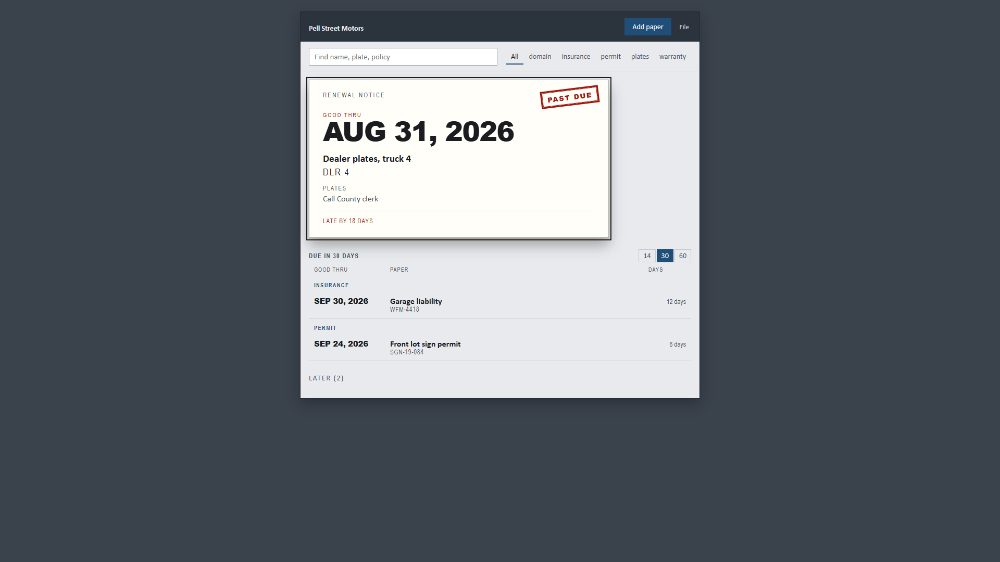
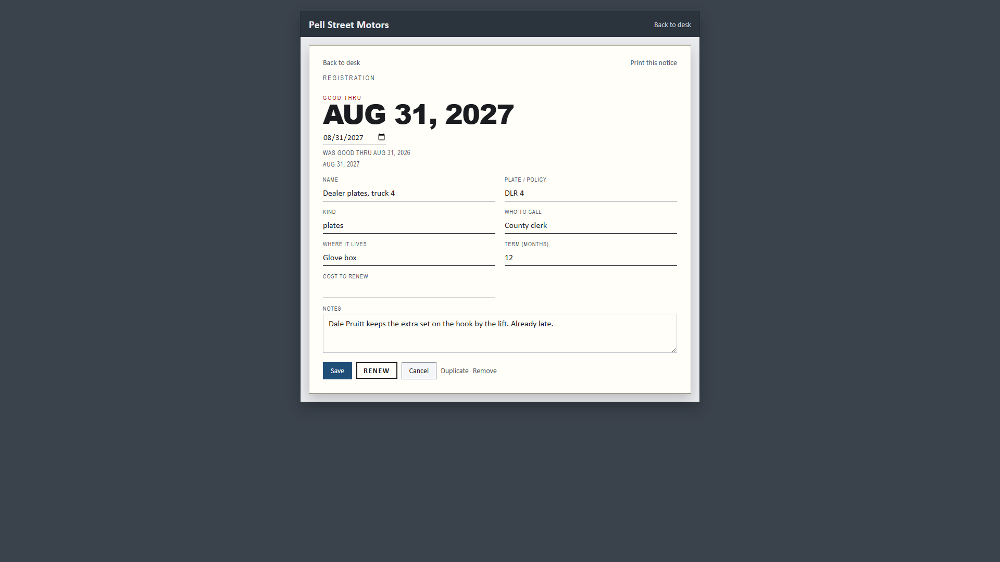
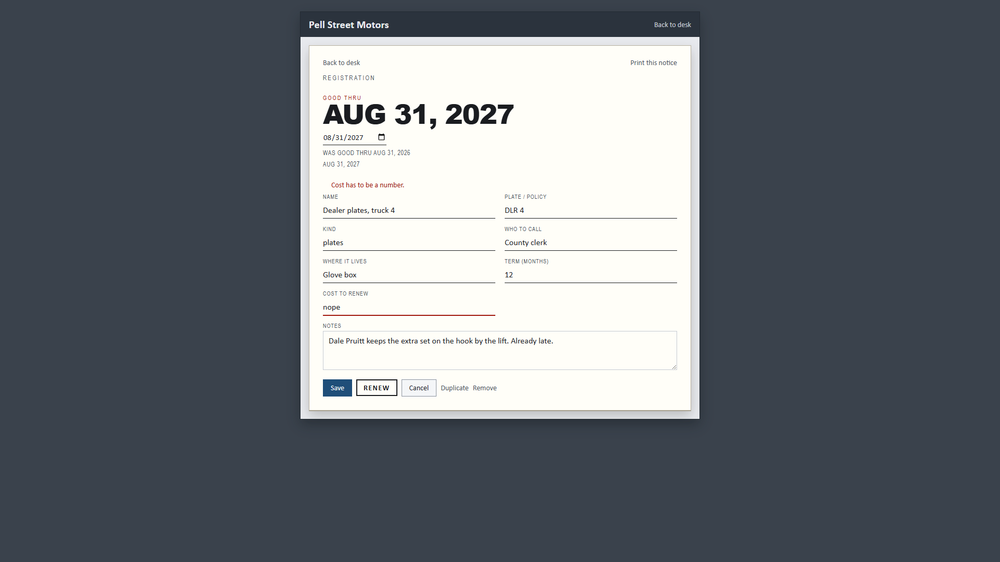

# Expires

This keeps a list of plates, insurance, permits, and other
papers that run out on a date. If one is already late, it
shows up like a notice in the mail. Drop `src/lib/` into a
React app you already have.

The sample is Pell Street Motors. Names are fake. Emails end in
`.example`.

## Who it is for

A shop or household that already runs React and has a few
papers with an end date. They want to see what is due and
where the paper lives.

## What you get

Copy `src/lib/`. That folder is the component.

- `Workspace.jsx` - the list plus the open paper
- `PaperPage.jsx` - add a paper and edit one
- `expires.css` - the look
- `papers-json.js` - dates, due piles, download, load parse
- `sample-papers.js` - Pell Street Motors sample
- `index.js` - the import

There is no account and nothing sends mail. Host apps pass
`value` and `onChange`. The demo keeps the list in this
browser. Load the sample again if you want Pell Street back.
Older files with `{ id, name, kind, expires, where }` still
open.

Late papers sit like a mailed notice. The big date is when it
was good through. Coming-due papers are listed by date and
grouped by kind. You can look 14, 30, or 60 days ahead. Later
stays folded. Open a paper to edit it. Renew moves the date
forward and keeps the old one on the card. Hold a late paper
until a day and it leaves the late pile. Find matches the
name or the plate. A blank date or a junk cost misses.
Escape cancels. Quiet Remove with undo. Print the notice or
the due list. j and k move through late then soon. Enter
opens. n adds. / finds.

## Run the demo

```
npm install
npm start
```

Open http://127.0.0.1:48417/

The demo site:

- Landing: http://127.0.0.1:48417/#/
- Sign in: http://127.0.0.1:48417/#/sign-in
- How: http://127.0.0.1:48417/#/how
- Desk: http://127.0.0.1:48417/#/desk

Sign in names the list this browser will keep. There is no
email. Hosted copy: https://aaronlb912.github.io/expires/

Files: https://github.com/Aaronlb912/expires

## Demo







https://github.com/user-attachments/assets/ad5e2fa1-6d5a-4b89-98df-d595f1bff123

Repo copy: [docs/media/expires-demo.mp4](docs/media/expires-demo.mp4)

Voice is Microsoft Andrew Neural. Music is Wallpaper by Kevin MacLeod (incompetech.com), CC BY 3.0.

## Use it in your own React app

1. Copy the `src/lib/` folder into your project (for example
   `src/lib/`).
2. Import the workspace.

```jsx
import { useState } from 'react'
import { Workspace, sampleBook } from './lib/index.js'

export function Papers() {
  const [book, setBook] = useState(sampleBook)
  return <Workspace value={book} onChange={setBook} />
}
```

Change the title and the papers. Edit `src/lib/expires.css` if
you want a different look.

`value` is a book: `title`, `papers`, and `dueWindowDays`
(14, 30, or 60). A paper has `id`, `name`, `kind`, `expires`,
`where`, `issuer`, `notes`, `ref`, `termMonths`,
`previousExpires`, `holdUntil`, and `cost`. Pass `onChange`
when the book changes.
